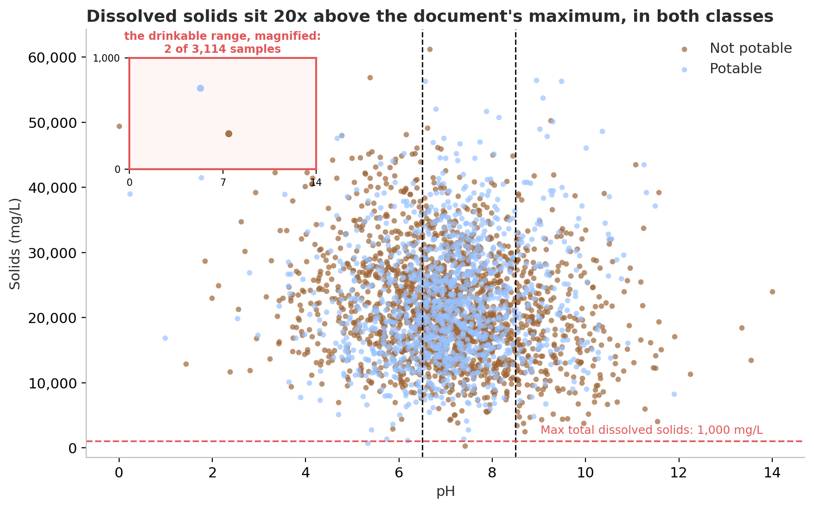
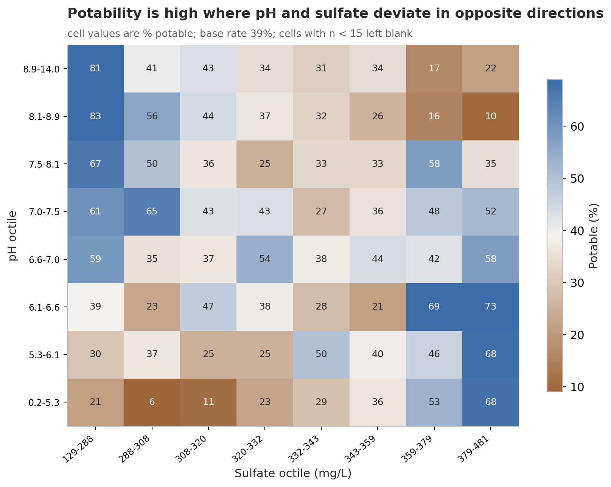

# Why does nothing correlate with potability?

An exploratory analysis of a water-quality dataset that starts from a failed chart. My
first pass ended with every feature correlating with the `Potability` label at |r| < 0.04
and a note underneath it reading *"I am wondering why???"*. This notebook answers that,
and the answer turns out to be more interesting than "the data is noise".

**→ [`01-why-nothing-correlates.ipynb`](01-why-nothing-correlates.ipynb)**

---

## The question

If a water sample is labelled potable, something about its chemistry should say so. Nine
physico-chemical measurements are available and none of them correlates with the label.
Why not — and does that mean there is nothing to find?

## The data

[Water Quality — drinking water potability](https://www.kaggle.com/datasets/adityakadiwal/water-potability),
Aditya Kadiwal, Kaggle. Released **CC0 (public domain)**, so republishing is permitted.

3,276 samples, 9 features, one binary target (39% potable). Three columns have missing
values: `ph` (15.0%), `Sulfate` (23.8%), `Trihalomethanes` (4.9%).

Threshold values quoted in the notebook come from the project briefing document that
accompanied the assignment, not from the dataset itself.

## Key findings

1. **The file was generated, not measured.** Every non-null value in every column is
   distinct, carrying 12–15 decimal places — instruments round, generators do not. 99.9%
   of samples exceed the document's limit for dissolved solids and 8% exceed the
   concentration of seawater. The nine columns are mutually near-independent (median
   |r| = 0.02) where real water chemistry would put hardness, conductivity and dissolved
   solids above 0.7.

2. **The missing values are missing completely at random** with respect to the label
   (p = 0.16, 0.35, 0.20). That is what makes dropping and imputing rows defensible here,
   and it is the check that justifies the cleaning rather than merely accompanying it.

3. **Only one of the document's eight guideline bands separates the classes.** Samples
   inside the pH 6.5–8.5 window are potable 43.9% of the time against 35.6% outside it.
   Chloramines, conductivity, trihalomethanes and turbidity land within two points of the
   base rate; the remaining three bands have too few samples on one side to compare at
   all. No sample in the file satisfies all eight thresholds simultaneously.

4. **The correlation chart was right, and I was reading it wrong.** Pearson correlation
   detects *linear, monotone, marginal* relationships. pH has a clear hump-shaped effect
   — 31% potable in the most acidic decile, 48% around pH 7.4–7.8, 32% by pH 8.3–9.1 —
   which a straight line averages away to r = +0.014.

5. **The label is driven by an interaction between pH and sulfate.** Water is labelled
   potable when the two sit on *opposite* sides of their means (49.2%) and not when they
   sit on the same side (31.8%). The product of the two standardised columns correlates
   −0.22 with the label — six times the strongest single-feature correlation anywhere in
   the file, and fifteen times that of either ingredient.

6. **A random forest reaches ROC AUC 0.708 where logistic regression reaches 0.482** —
   and a logistic regression handed the 36 pairwise products reaches 0.683, recovering
   **88% of the forest's advantage over chance**. The signal is overwhelmingly pairwise
   interaction rather than deeper structure. A label-permutation null puts the forest
   about 15 standard deviations above chance.

Because the data is synthetic, all of this describes the generator rather than drinking
water. The pH–sulfate pattern is in fact chemically backwards, which is itself part of
the evidence.

## Selected figures

**The guideline thresholds sit at the very bottom of the data, not through the middle of
it.** Two samples of 3,114 fall inside the range the project document calls drinkable.



**The shape of the label.** Potability is high on the anti-diagonal and low in the
matching corners — a saddle, which averages to nothing along either axis.



## Running it

```bash
pip install -r ../requirements.txt
jupyter lab 01-why-nothing-correlates.ipynb
```

`water_potability.csv` is in this folder. The notebook also looks in Kaggle's
`/kaggle/input` directory, so it runs unchanged when published there.

Runs top to bottom on a fresh kernel in roughly a minute. The two interactive charts are
Plotly and load plotly.js from a CDN — they need a connection the first time, and they do
not render in GitHub's notebook preview. Open the notebook in Jupyter, nbviewer, or on
Kaggle to use them.

## Also in this folder

`your_report.html` / `SWEETVIZ_REPORT.html` and friends are automated profiling passes
(`ydata-profiling`, `sweetviz`) run before the hand analysis began. The missingness
matrix in section 4 of the notebook started from them.

`EDA.ipynb` is my original first-pass notebook, kept unchanged for comparison.
