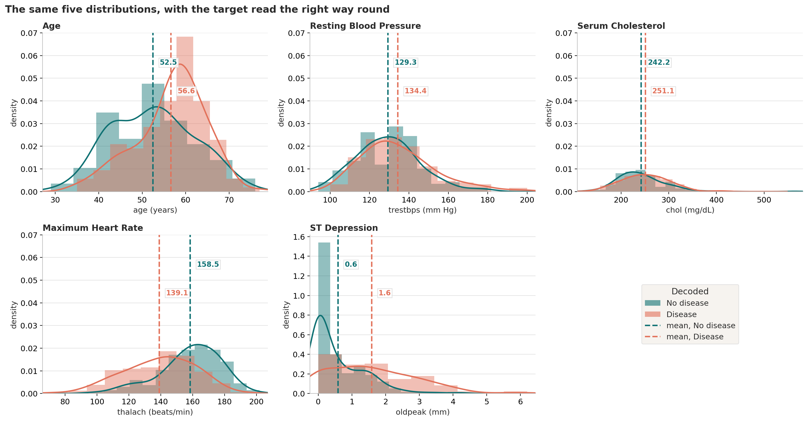
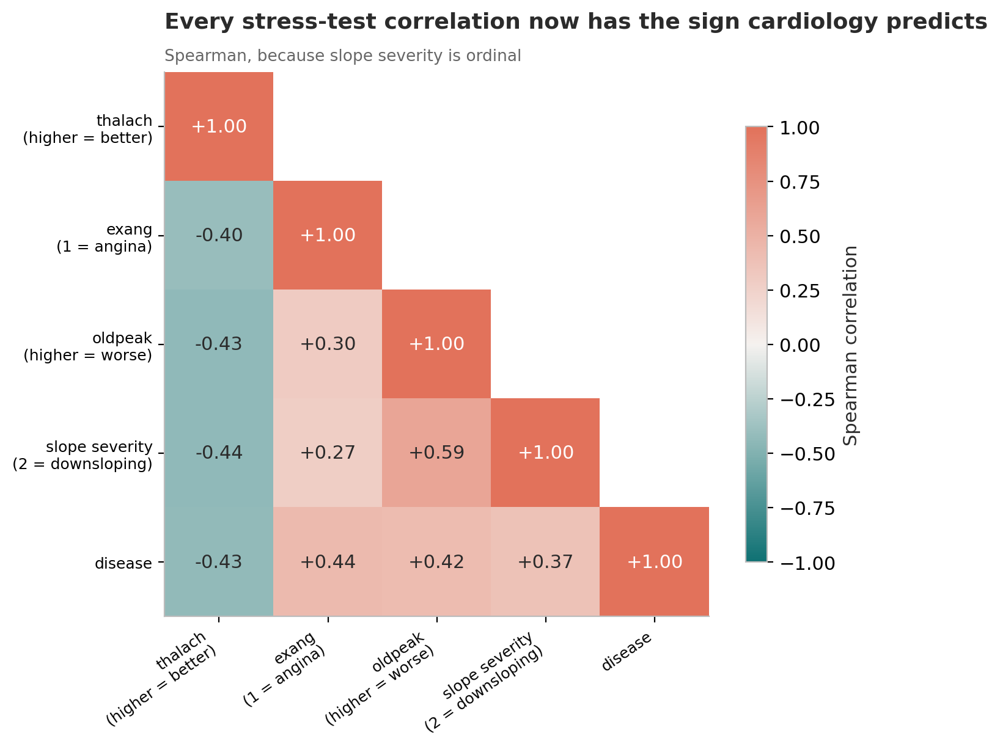

# Every anomaly in this dataset was the same bug

An exploratory analysis of the Cleveland Heart Disease data that begins as a medical
translation guide — what does each column measure, and which direction counts as bad? —
and turns into a data-integrity investigation when five separate things refuse to make
sense.

**→ [`01-every-anomaly-was-one-bug.ipynb`](01-every-anomaly-was-one-bug.ipynb)**

---

## The question

My first pass flagged five anomalies and moved on:

- 104 patients with the chest-pain code most suggestive of disease were labelled healthy.
- `ca = 0` — no blocked vessels on angiography — held 130 diseased against 45 healthy.
- Patients labelled diseased were younger, with lower blood pressure, lower cholesterol,
  less ST depression and a *higher* maximum heart rate.
- Every stress-test correlation had the wrong sign.
- More women than men had heart disease.

Are these five problems, or one?

## The data

- **[`heart.csv`](heart.csv)** — the widely circulated 303-row Kaggle redistribution.
- **[`processed.cleveland.data`](processed.cleveland.data)** and
  [`heart-disease.names`](heart-disease.names) — the authoritative original from the
  [UCI Machine Learning Repository](https://archive.ics.uci.edu/dataset/45/heart+disease)
  (Detrano et al., 1989; donated by David Aha). Released **CC BY 4.0**. Extracted from
  `heart+disease.zip` in this folder so the notebook can join against it directly.

303 patients referred for diagnostic workup, 13 measurements and a diagnosis. **This is a
referral population** — everyone here was already suspected of heart disease — so no rate
in the analysis is a population prevalence.

## Key findings

1. **`heart.csv` is a systematically re-encoded copy of the UCI file.** Joining the two
   on the eight columns that were *not* altered pairs 301 of 303 patients unambiguously
   and recovers the mapping exactly, with no bleed in any cross-tabulation.

2. **The target is inverted.** `target = 1` means *no* disease, in all 301 matched rows
   without a single exception.

3. **`cp`, `restecg` and `slope` are reversed end to end**, and `thal` is re-sorted. So
   `cp = 0` is asymptomatic rather than typical angina, and `slope = 0` is downsloping
   rather than upsloping.

4. **`ca = 4` and `thal = 0` are missing values, not categories** — 7 patients. In my
   first pass I deleted a patient because I could not believe someone with "four blocked
   vessels" was healthy. Nobody has four blocked vessels; that angiogram result is absent.

5. **Three columns looked *correct* because they contained two compensating errors.**
   Reversing the codes and inverting the target cancel out, so `slope`, `thal` and
   `restecg` produced exactly the picture I predicted, for two wrong reasons. The columns
   that gave the bug away were the ones with only one error left — `ca`, whose codes were
   never re-encoded. This is the part of the analysis I most want to remember.

6. **Decoded, every anomaly resolves.** `ca` becomes a clean dose-response (25.7% → 67.7%
   → 81.6% → 85.0% disease as blocked vessels rise); reversible thallium defects are the
   worst thallium result at 76.1%; upsloping ST is the healthiest slope at 24.6%; all four
   stress-test correlations take the sign cardiology predicts.

7. **Men are diseased at 55.1% against 25.0% for women**, reversing my original
   conclusion, which came from the inverted target compounded with a reversed `sex`
   coding. The cohort is 68% male, which is a fact about referral, not prevalence.

8. **The stress test carries the signal; cholesterol carries none.** `thalach`
   (Cohen's d = −0.92) and `oldpeak` (+0.93) dominate, while `chol` does not separate the
   groups at all (d = 0.17, p = 0.14) — what a referral population does to a classical
   risk factor.

9. **303 rows, 302 patients.** One 38-year-old man appears twice, and one diseased
   patient from the UCI original is missing entirely. Anyone modelling this file should
   drop the duplicate before splitting.

Two values I had deleted as "physiologically impossible" — a cholesterol of 564 mg/dL and
6.2 mm of ST depression — appear in the UCI original exactly as recorded. They are
extreme, not implausible, and they are back in.

## Selected figures

**The decode, applied.** The same five distributions, with the target read the right way
round: diseased patients become older, with more ST depression and a lower achievable
heart rate.



**The sign flip.** Every stress-test correlation now points the way cardiology predicts.



## Running it

```bash
pip install -r ../requirements.txt
jupyter lab 01-every-anomaly-was-one-bug.ipynb
```

Both data files are in this folder. The notebook also looks in Kaggle's `/kaggle/input`
directory — attach the UCI file as well as `heart.csv` if you publish it there, otherwise
the decoding section has nothing to join against.

Runs top to bottom on a fresh kernel in under a minute. The two interactive charts are
Plotly and load plotly.js from a CDN — they need a connection the first time, and they do
not render in GitHub's notebook preview. Open the notebook in Jupyter, nbviewer, or on
Kaggle to use them.

## Also in this folder

`EDA.ipynb` is my original first-pass notebook, kept unchanged for comparison.
`UCI_Data.ipynb`, `Data_review.pdf` and `Explain_Heart_Data.pdf` are working notes from
the same period.
