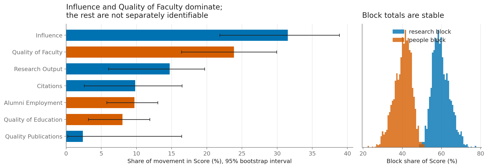
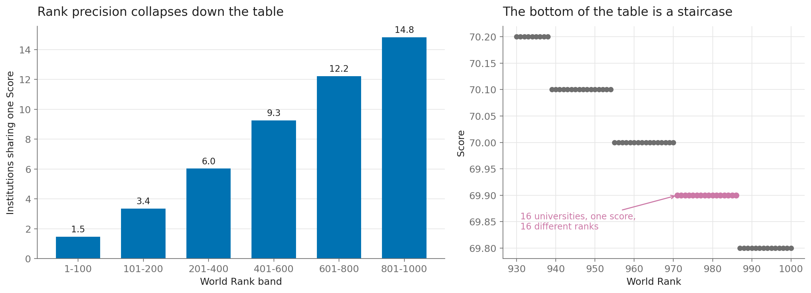

# What does a world university ranking actually reward?

An audit of the **CWUR World University Rankings, 2018–19** — 1,000 institutions,
61 countries. Rather than asking which universities are good, this project asks
what the ranking itself is made of, and how much precision its numbers carry.

**Notebook:** [`01-what-the-ranking-rewards.ipynb`](01-what-the-ranking-rewards.ipynb)

---

## The question

Rankings are read as if position 971 means something different from position 986.
Three questions test that:

1. What is `Score` made of, and what weight does each indicator carry?
2. How much of the table is actually measured rather than censored?
3. How much precision does a single rank position really carry?

## Data

| | |
|---|---|
| Source | Center for World University Rankings (CWUR), 2018–19 edition |
| File | `eighteen_nineteen_university_datasets.csv` — 1,000 × 12 |
| Encoding | Windows-1252 (**not** UTF-8 — see below) |
| Licence | **TODO: confirm CWUR's terms permit redistribution before publishing** |

Seven indicator columns, all of them **ranks** (lower is better), plus an overall
`Score` and a `World Rank`.

## Method

- Sentinels `-` and `> 1000` are treated as **right-censoring**, not missingness:
  the true rank is known to be *at least* as bad as a cutoff. The loader returns
  three aligned frames — measured values, values with the censoring floor filled
  in, and a boolean mask — so every result can be reported both ways.
- `Score` is regressed on `log(rank)` across the seven indicators, on the
  uncensored subset, with a 2,000-replicate row bootstrap for the intervals.
- Country-level statistics use measured values only and require at least five
  ranked institutions.

## Key findings

1. **`World Rank` is `Score` sorted descending.** Not correlated with it —
   derived from it. Correlating the two measures a definition.
2. **`Score` is reproducible from the seven indicators at R² = 0.98.** The
   research block accounts for ~60% of its movement (95% CI 52–69%), the
   people block ~40%.
3. **The four research indicators correlate 0.72–0.93 with each other**, so their
   individual weights are not identifiable — only the block total is.
4. **Rank precision is largely an illusion.** `Score` is published to one decimal,
   giving 195 distinct values for 1,000 institutions. Sixteen universities all
   score 69.9 and are handed ranks 971–986. Mean tie-group size rises from 1.5 in
   the top 100 to 14.8 in ranks 801–1000.
5. **Research strength and student outcomes track each other only among the top
   ~14 institutions**, then diverge sharply — though this says as much about how
   the two indicator families are constructed as about the universities.





## Two data-handling notes

- **Encoding.** Reading the file as `unicode_escape` mangles 70 institution
  names (*Wisconsin–Madison*, *São Paulo*). The names are fine; the codec was
  wrong. Column headers also contain non-breaking spaces.
- **Coverage.** `Quality of Faculty` is censored for 73% of rows and
  `Quality of Education` for 60%, against 5–17% for the research indicators.
  Anything built on them is a bound, not an estimate.

## How to run

```bash
pip install -r ../requirements.txt
jupyter lab 01-what-the-ranking-rewards.ipynb
```

Runs top to bottom on a fresh kernel. The only network call fetches flag images
for one chart; it caches to `assets/flags/` and degrades gracefully offline.

## Limitations

- Heavy censoring on two indicators; conclusions resting on them are bounds.
- Recovered weights come from 137 uncensored top-200 institutions — a selected
  sample, so weights may differ further down the table.
- A single edition, so nothing here speaks to change over time.
- Continent assignment for Russia is a judgement call, flagged in the notebook.
